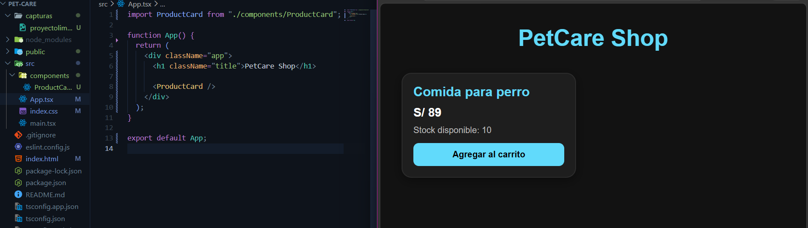
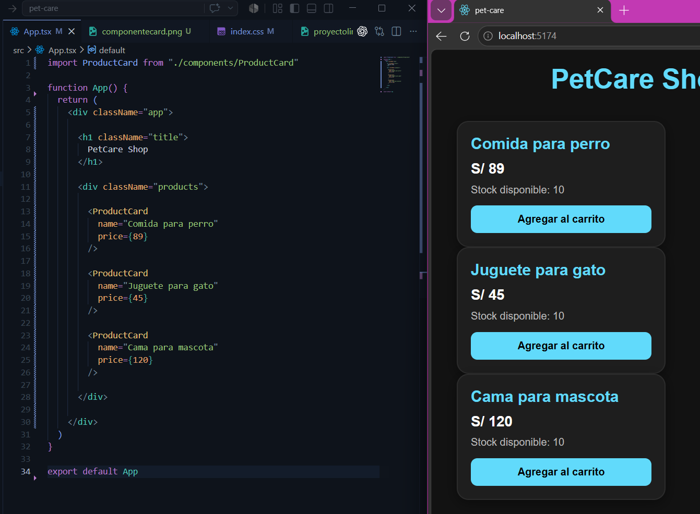
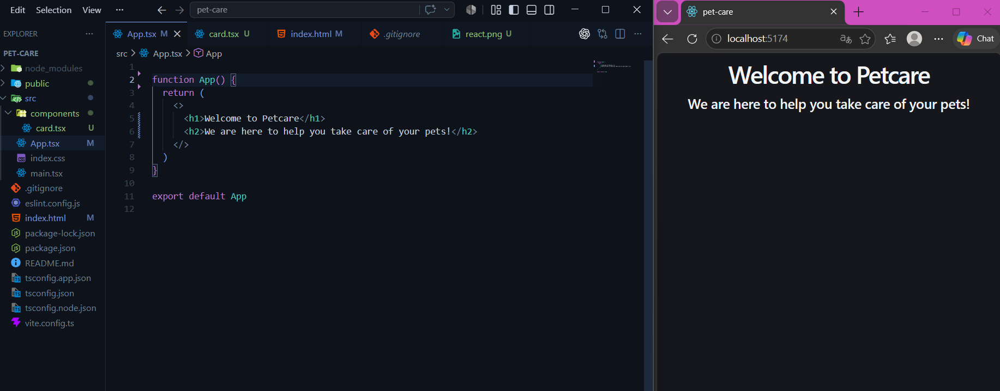
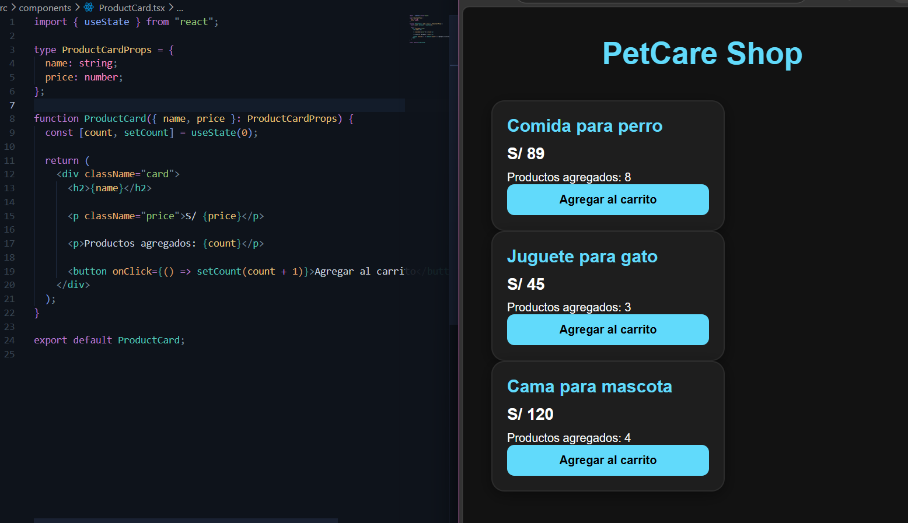

# 🐾 Laboratorio Semana 10

## Ingredientes :

### Rivera Anderson

### Carbajal Carlos

### Huancca Yojhan

Proyecto desarrollado con React + Vite como parte del curso de Desarrollo Frontend.

La aplicación simula una pequeña tienda virtual de productos para mascotas, aplicando conceptos básicos de React como:

- Componentes
- Props
- Estados
- Eventos
- Renderizado dinámico

---

# 🚀 Tecnologías utilizadas

- ⚛️ React
- ⚡ Vite
- 🟨 JavaScript
- 🎨 CSS

---

# 📦 Instalación

## Clonar el repositorio

```bash
git clone https://github.com/Ingaxgaramendi/PetcareReact.git
```

## Entrar al proyecto

```bash
cd PetcareReact
```

## Instalar dependencias

```bash
npm install
```

## Ejecutar el proyecto

```bash
npm run dev
```

---

# 📸 Capturas del proyecto

## 🧩 Componente creado



---

## 🔄 Props enviadas al componente



---

## 🧹 Proyecto limpio



---

## ⚙️ Uso de estados y eventos



---

# 📚 Conceptos aplicados

✅ Componentes React  
✅ Props  
✅ useState  
✅ Eventos con onClick  
✅ Renderizado dinámico  
✅ Estructura limpia del proyecto  
✅ Git y GitHub

---
