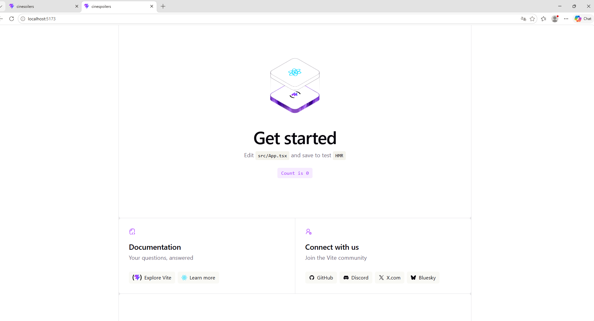
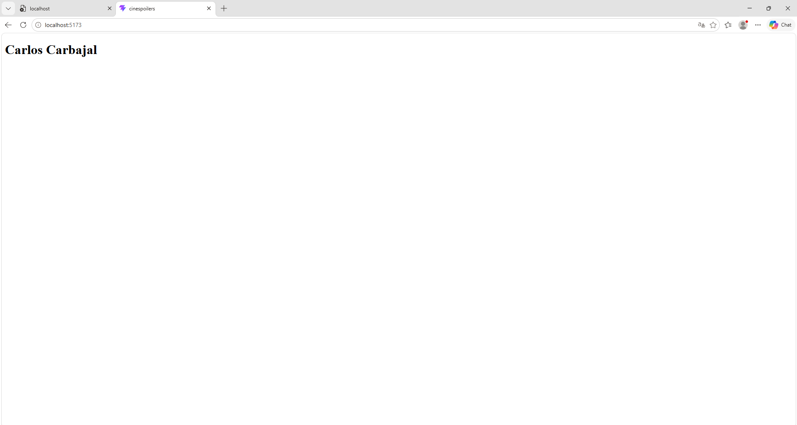
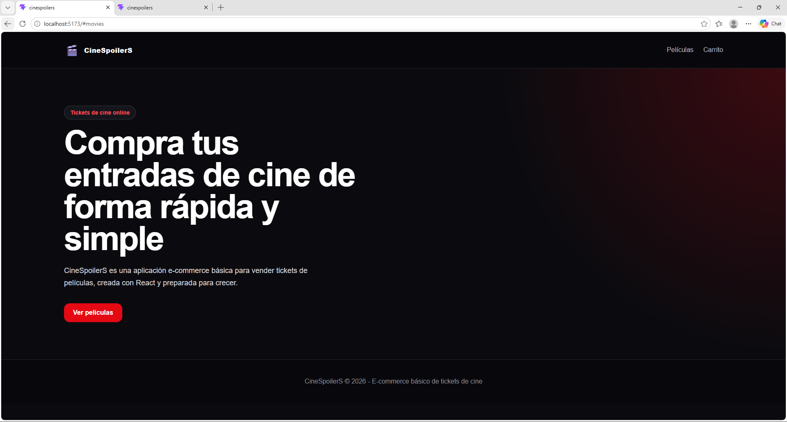
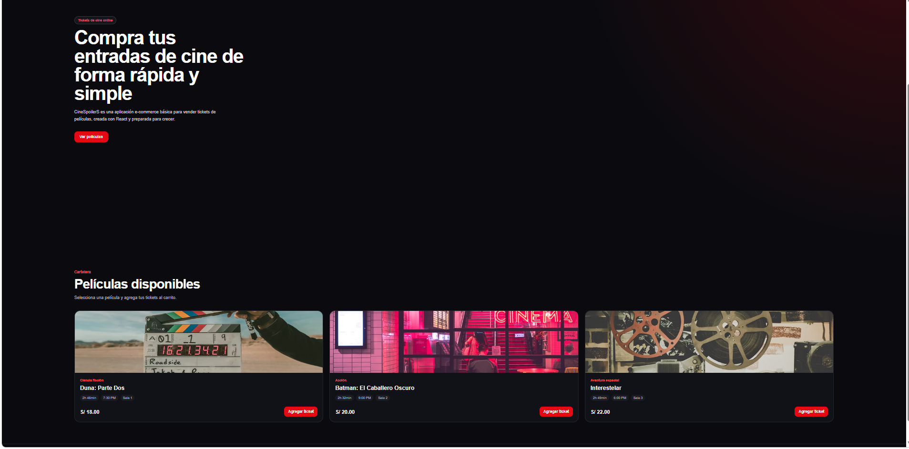
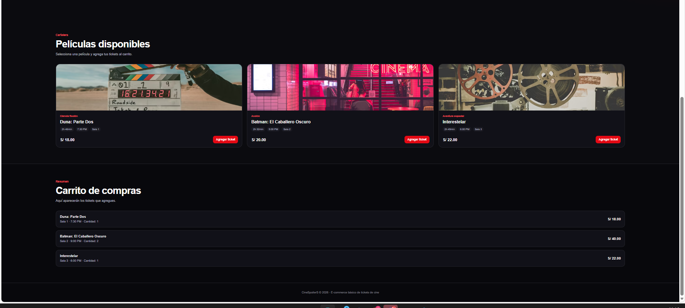
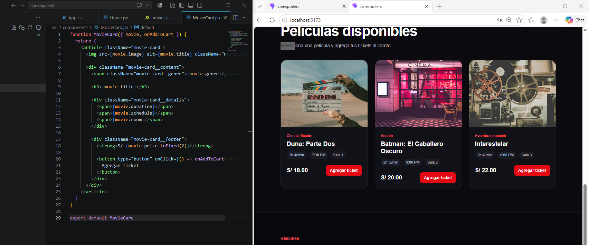
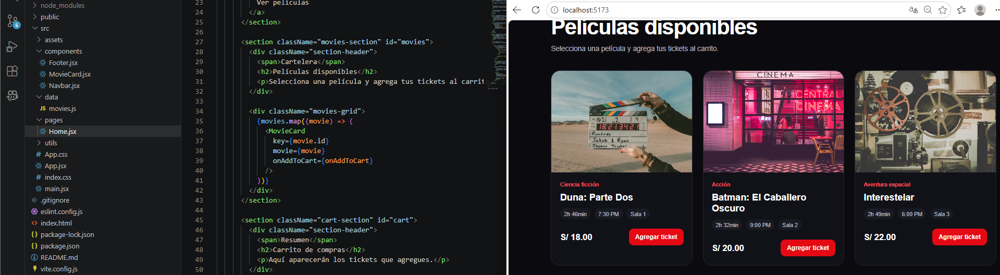
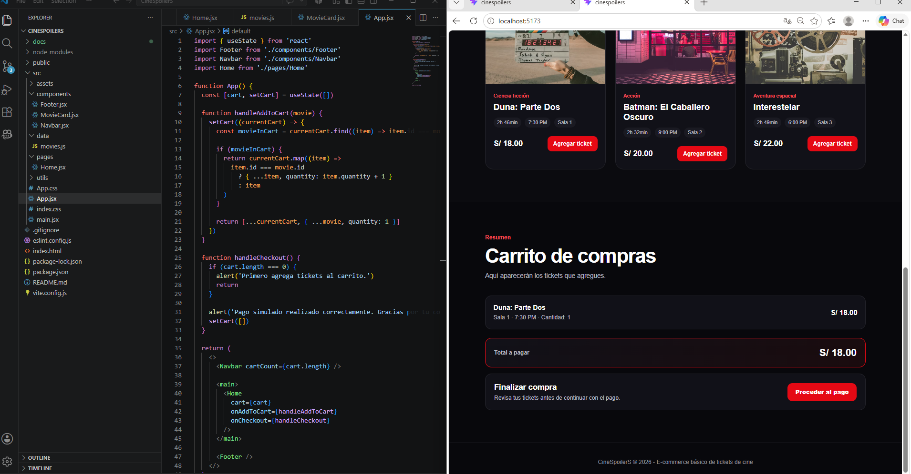
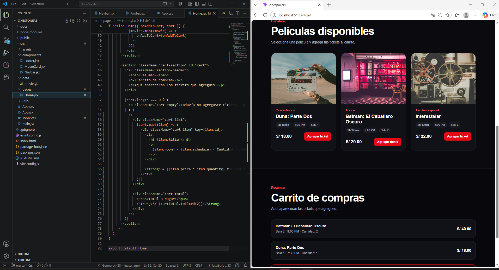

# 🐾 Laboratorio Semana 10

## Ingredientes :

### Rivera Anderson

### Carbajal Carlos

### Huancca Yojhan

Proyecto desarrollado con React + Vite como parte del curso de Desarrollo Frontend.
aplicando conceptos básicos de React como:

- Componentes
- Props
- Estados
- Eventos
- Renderizado dinámico

---

# 🚀 Tecnologías utilizadas

- ⚛️ React
- ⚡ Vite
- 🟨 JavaScript
- 🎨 CSS

---

# 📸 Capturas del proyecto

# Yojhan huancca

### 1. Vista inicial


### 2. Favicon configurado

Se agrego un icono personalizado en la pestana del navegador usando un archivo SVG en la carpeta `public`.

Ruta de imagen: `docs/02favicon.png`


### 3. Componente Card

Se creo una tarjeta reutilizable para mostrar el nombre y la descripcion.

Ruta de imagen: `docs/03.compoentes.png`


### 4. Uso de props

El componente `Card` recibe los valores `title` y `description` desde `App.tsx`.

Ruta de imagen: `docs/04.carpProps.png`


### 5. Manejo de estado

Se agrego `useState` para controlar el contador de likes. Cada tarjeta tiene su propio estado y aumenta al presionar el boton.

Ruta de imagen: `docs/05.manejostado.png`


## Codigo principal

### Componente Card

```tsx
import { useState } from "react";

type CardProps = {
  title: string;
  description: string;
};

function Card({ title, description }: CardProps) {
  const [likes, setLikes] = useState(0);

  const handleClick = () => {
    setLikes(likes + 1);
  };

  return (
    <div className="card">
      <h3>{title}</h3>
      <p>{description}</p>
      <button className="button" onClick={handleClick}>
        Likes {likes}
      </button>
    </div>
  );
}

export default Card;
```

# Anderson rivera

# 📦 Instalación

## Clonar el repositorio

git clone https://github.com/Ingaxgaramendi/PetcareReact.git

## Entrar al proyecto

```bash
cd PetcareReact
```

## Instalar dependencias

```bash
npm install
```

## Ejecutar el proyecto

```bash
npm run dev
```

---

## 🧹 Proyecto limpio


## 🧩 Componente creado


---

## 🔄 Props enviadas al componente


---

---

## ⚙️ Uso de estados y eventos


---

# Carbajal Carlos

## 1. Proyecto creado con React + Vite

Se inició el proyecto usando React con Vite.



---

## 2. Proyecto limpio

Se eliminó la plantilla inicial de Vite y se dejó una base limpia para comenzar el desarrollo.



---

## 3. Primera versión de la pantalla principal

Se creó la primera vista de la aplicación CineSpoilerS.


---

## 4. Mejora visual de la interfaz

Se aplicó una interfaz oscura, minimalista y más atractiva.



---

## 5. Interfaz principal mejorada

Se mejoró la portada principal con mejor distribución visual.



---

## 6. Catálogo de películas

Se agregó la cartelera de películas disponibles para comprar tickets.



---

## 7. Componente Card

Se creó un componente reutilizable para mostrar cada película como una tarjeta.



---

## 8. Envío de props

Se evidencia el envío de datos desde el componente padre hacia el componente hijo usando props.



---

## 9. Manejo de estado

Se utilizó `useState` para manejar el estado del carrito de compras.



---

## 10. Carrito de compras

El carrito muestra los tickets agregados, la cantidad y el total a pagar.



# 📚 Conceptos aplicados

✅ Componentes React  
✅ Props  
✅ useState  
✅ Eventos con onClick  
✅ Renderizado dinámico  
✅ Estructura limpia del proyecto  
✅ Git y GitHub

---
